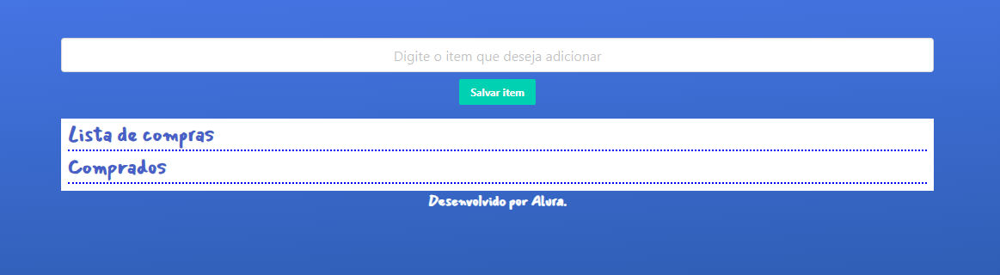

# Lista de Compras Inteligente 🛒

Uma aplicação web para criar e gerenciar uma lista de compras. O projeto é totalmente funcional, permitindo adicionar, editar, marcar como comprado, excluir itens e salvar a lista para sessões futuras.

## ❯ Sobre o Projeto

Este projeto foi desenvolvido como parte do curso **"JavaScript: manipulando objetos"** da Alura. O principal objetivo foi aplicar na prática os conceitos de criação e manipulação de objetos e arrays em JavaScript, além de solidificar o conhecimento sobre interação com o DOM e armazenamento local (`localStorage`).

## ✨ Funcionalidades

- **Adicionar Itens:** Insere novos itens na lista.
- **Marcar como Comprado:** Move itens da lista "A Comprar" para a lista "Comprados" ao marcar o checkbox.
- **Editar Itens:** Permite a edição do nome de um item diretamente na lista.
- **Excluir Itens:** Remove itens da lista de forma permanente.
- **Persistência de Dados:** A lista é salva automaticamente no `localStorage` do navegador, para que não se perca ao fechar ou atualizar a página.
- **Verificação de Duplicatas:** Impede que o mesmo item seja adicionado mais de uma vez (ignorando maiúsculas/minúsculas).

## 💡 Principais Conceitos Praticados

O desenvolvimento desta aplicação foi uma excelente oportunidade para praticar:

- **Manipulação de Objetos:** Cada item da lista é um objeto com propriedades como `valor` e `checar`, demonstrando como estruturar dados de forma organizada.
- **Manipulação de Arrays:** Uso intensivo de métodos de array, como:
  - `push()`: para adicionar novos itens.
  - `forEach()`: para iterar e renderizar os itens na tela.
  - `some()`: para a verificação eficiente de itens duplicados.
  - `splice()`: para remover itens específicos do array.
- **Manipulação do DOM:** Criação e atualização dinâmica de elementos HTML para refletir o estado atual da lista de compras.
- **Eventos do Navegador:** Utilização de `addEventListener` para capturar eventos de `submit` do formulário e `click` nos ícones e checkboxes.
- **Armazenamento Local (`localStorage`):**
  - Uso de `localStorage.setItem()` e `localStorage.getItem()` para salvar e recuperar a lista.
  - Aplicação de `JSON.stringify()` e `JSON.parse()` para converter o array de objetos para uma string e vice-versa.
- **Operadores Ternários:** Utilizados para renderizar condicionalmente os botões de "editar" ou "salvar edição".

## 🛠️ Tecnologias Utilizadas

- 
-  (com classes do framework **Bulma CSS** para agilizar a estilização)
-  (Vanilla JS - ES6+)
-  para os ícones.

## 🚀 Como Executar

Este é um projeto puramente frontend e não requer um passo de compilação.

1.  Clone este repositório para a sua máquina local.
2.  Abra o arquivo `index.html` diretamente no seu navegador de preferência.
    - _Recomendação:_ Use a extensão **"Live Server"** no VS Code para uma melhor experiência de desenvolvimento.

---

## 👨‍💻 Autor

Desenvolvido por **[Mateus Messias da Silva]**.

